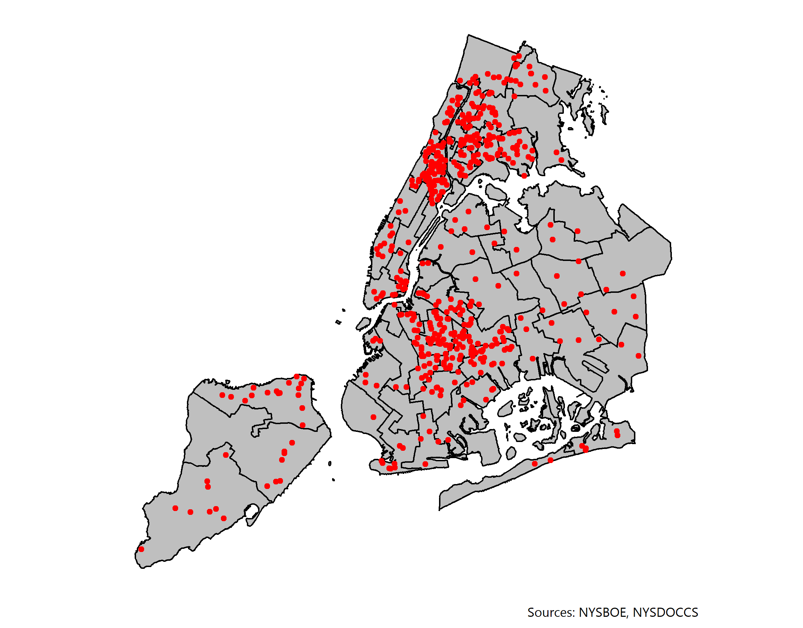

<!-- --- -->
<!-- title: "Rethinking Felony Disenfranchisement: The Case of New York City and Miami" -->

<!-- # to produce blinded version set to 1 -->
<!-- blinded: 0 -->

<!-- authors: -->
<!-- - name: Kevin Morris -->
<!--   thanks: The author gratefully acknowledges Jacob Faber and Jeff Manza for their advisement of this project. He would also like to thank colleagues at the Brennan Center for Justice for their insights into this project. -->
<!--   affiliation: Robert F. Wagner School of Public Service, New York University -->

<!-- keywords: -->
<!-- - 3 to 6 keywords -->
<!-- - that do not appear in the title -->

<!-- abstract: | -->
<!--   The text of your abstract.  200 or fewer words. -->

<!-- output: rticles::asa_article -->
<!-- --- -->
```{r setup, echo = F, message = F}
knitr::opts_knit$set(root.dir = "..")
library(scales)
library(ggplot2)
library(extrafont)
```
"There is no Negro problem. There is no Southern problem. There is no Northern problem. There is only an American problem"

-*Lyndon Johnson, March 15, 1965*

#Introduction

Felony disenfranchisement has received much attention over the past few years. This is true in both the academic world (where researchers have dug into the political ramifications in such races as the 2000 presidential election) and in the political world as states such as Florida and Louisiana have gradually moved to dismantle their systems of disenfranchisement. Throughout this process, however, many researchers have focused on the *individual* effects of felony disenfranchisement. They have examined the effect of disenfranchisement on the political participation of individuals, including after they are no longer disenfranchised, but have generally neglected to examine the intersection of spatially concentrated policing and incarceration patterns with the political effects of disenfranchisement. This paper seeks to increase our understanding of the spatial implications of felony disenfranchisement by examining the character of disenfranchisement in New York City and Miami-Dade County in Florida.

This paper also seeks to complicate the narratives surrounding the end of felony disenfranchisement. Although advocates are correct to push for an end to disenfranchisement, a change to the political system may not be sufficient to reincorporate the voices of formerly incarcerated individuals into the democratic process. In addition to laying out the spatial implications of felony disenfranchisement in two major American cities, this paper also explores the impact of two different policies intended to dismantle the disenfranchisement program. Specifically, I investigate the effect of Executive Order 181 (which ended the disenfranchisement of parolees in New York State) and  Amendment 4 (which restored the voting rights of Floridians who had completed all terms of their sentences). The effects of these policies make clear that, while the end of felony disenfranchisement is necessary, active steps must be taken to reincorporate the formerly disenfranchised.

#Background of Felony Disenfranchisement in the United States

In all but two states (Maine and Vermont), felony disenfranchisement laws ensure that American citizens convicted of felony offenses lose the right to vote for at least some period of time. In some states, such as Oregon and Massachusetts, individuals lose that right only for the period in which they are actively incarcerated. In other states, notably Kentucky and Iowa, felony convictions result in lifelong disenfranchisement unless a returned citizen receives an individual pardon from the state's governor [@bcj_laws]. This variation in laws flows directly from language in the Fourteenth Amendment which allows states to revoke individuals' voting rights "for participation in rebellion, or other crime." The definition of "other crime," left so vague in the Constitution, is now generally used by states to encompass any felony offense at all. The Supreme Court, in cases such as *Richardson v. Ramirez*, has upheld states' right to do just that. Collectively, these laws disenfranchise as many as `r 6.1 - 1.4` million American citizens. Of these, the majority are no longer incarcerated, but are living and working in their communities [@sentencing_2016].^[The figures reported in @sentencing_2016 have been adjusted to reflect the impact of Amendment 4 in Florida.]

In any discussion of felony disenfranchisement in the United States, it is imperative to acknowledge the central role played by race and white supremacy. As Traci Burch has explained, "If policies restricting the voting rights of offenders disparately affect one racial group or party, it is because such policies were intended to" [@Burch2010]. The historical record is undeniable. Previous research established that the presence of nonwhite potential voters is associated with the implementation of felony disenfranchisement policies and that these policies were often adopted during Jim Crow to reduce the political power of Black Americans [@Behrens2003]. In Florida felony disenfranchisement was added to the state constitution in 1868. Afterwards, a lawmaker boasted that the effort had been made in order to prevent Florida from being "niggerized" [@florida_1868].

The racial imbalance of felony disenfranchisement laws are not confined to the 19th century. Although the Voting Rights Act of 1965 did much to improve access to the ballot box for minorities, it did nothing to undermine the explicitly racialized system of disenfranchisement. Indeed, as the United States has vastly increased the reach of the carceral system in the post-Civil Rights era, the implications of felony disenfranchisement have only grown. As of 2016, more than 10 percent of African Americans were disenfranchised in 9 states. In Kentucky, the state with the highest level of disenfranchised Black residents, more than one in four Black adults are barred from casting a ballot. Although Black adults made up just `r percent(29932674 / 247219588, accuracy = 0.1)` of the voting age population in 2016, they accounted for `r percent(2228118 / 6106327, accuracy = 0.1)` of the disenfranchised population [@sentencing_2016].

#Academic Literature and Felony Disenfranchisement

In the aftermath of the 2000 presidential election, academic interest in the political implications of felony disenfranchisement was stirred thanks to a paper from Christopher Uggen and Jeff Manza [-@Uggen2002]. George W. Bush's margin of victory in Florida in 2000 was famously just 537 votes. In their 2002 paper, Uggen and Manza estimate the likely partisan composition of the disenfranchised population with felony convictions in their past. They estimate that, if this group had been allowed to vote, they would have supported Al Gore. Their enfranchisement, Uggen and Manza posit, would have tipped the presidential contest and resulted in the election of Al Gore. They based their estimates on the voting patterns of *non*-disenfranchised individuals who were demographically similar to the disenfranchised population. Though much of the research conducted since their 2002 study has undermined some of their key assumptions (namely, that formerly incarcerated individuals turnout and cast ballots similarly to those who have not been incarcerated), Uggen and Manza convincingly demonstrated that felony disenfranchisement can have material political consequences. In the years after the Uggen and Manza published their paper, scholars sought to investigate the effect of felony disenfranchisement on African American turnout [@Miles2004], young adult turnout [@Hjalmarsson2010], and other questions. Some of this research compared states and regions with differing disenfranchisement regimes to estimate these effects [@Miles2004; @Ochs2006]. Others have used survey data or interviews to construct their estimates [@Uggen2004; @Drucker2005].

In a series of papers in between 2009 and 2011, researchers developed methods for directly estimating the turnout of formerly disenfranchised individuals. Haselswerdt [-@Haselswerdt2009] matched release data and voter registration data from Erie County, NY, to estimate turnout among a small group of formerly incarcerated individuals. Traci Burch [-@Burch2010; -@Burch2011] expanded upon this matching methodology to estimate the voting patterns of formerly disenfranchised individuals in a range of states. She uses release data from states' Departments of Corrections and their Registered Voter Files to estimate the number of formerly incarcerated individuals who went on to register to vote. Using the Registered Voter Files, she is also able to estimate the party affiliation of formerly incarcerated individuals (in states with party registration) and the turnout rate among these individuals. Her methodology has been used to investigate other questions surrounding the voting patterns of formerly incarcerated individuals under different circumstances and to examine the impact of changes in disenfranchisement policy [@Meredith2013; @Meredith2015].

A number of papers have also explored the impact that felony disenfranchisement policies have on turnout among non-disenfranchised residents. King and Erickson [-@King2016], for instance, leverage state-level variation in disenfranchisement laws to estimate the impact that felony disenfranchisement has on turnout among African Americans. They use data from the 2004 Current Population Survey Voting and Registration Supplement to determine individual-level turnout. They include estimates of the share of African Americans who are disenfranchised in each state from @locked_out to explore the impact of these policies on eligible voters. Ultimately, they argue that "African American disenfranchisement plays a unique role in predicting African American voter turnout." They conclude that disenfranchisement has spillover effects for African American voters: where more African Americans are disenfranchised, elibible African Americans are less likely to cast a ballot. These findings are in line with other research that has explored whether the effects of disenfranchisement extend beyond those whose voting rights are directly suspended [@Bowers2009; @Ochs2006; @Walker2014]. As @Bowers2009 sum up: "[I]t is not solely the direct vote of ex-felons that is denied through these laws. [Felony disenfranchisement] impacts the political power of communities that extends beyond felons' collateral penalty."

These findings are not suprising given the large body of research establishing the social nature of voting. Outside the felony disenfranchisement conversation, an enormous body of research has demonstrated that individuals are far more likely to cast a ballot if their peers, family members or neighbors are doing so. [Build this out]

Although scholars have established that felony disenfranchisement decreases turnout among Black voters at the *state* level, relatively little research has been done on how felony disenfranchisement operates at the sub-state level. Though we know that Black voters are generally less likely to cast a ballot when they live in a state with strict disenfranchisement laws, less work has been done exploring the types of neighborhoods in which these effects are concentrated, and the impact these laws might have at the local level.


#Spatial Effects of Concentrated Policing and Incarceration

Previous literature has called attention to the racially disparate impacts of felony disenfranchisement in the United States. It has often failed, however, to explore the ways in which the disenfranchisement of individuals leads to a loss of political power for community members

##concentrated policing

#Research Design: Spatial Implications of Felony Disenfranchisement in New York City and Miami

##Matching
##Geocoding

#Maps


As we can see in Figure \ref{fig:citymap}, these are not distributed evenly throughout the city.

\newpage
#References